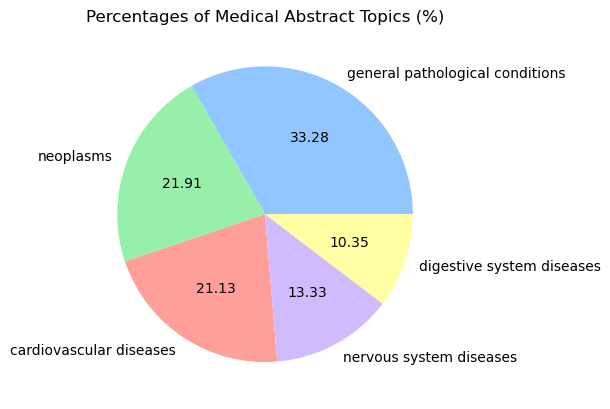
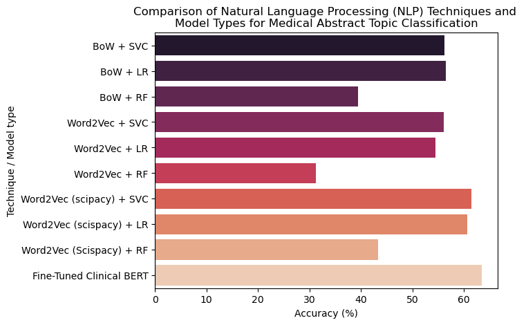

# A Bunch of Really Bad Natural Language Processing (NLP) Models for Text Classification

Oh boy, I sure do hope this isn't the best I ever get at NLP :satisfied:

In this repo, I've included my work to try and classify abstracts from articles in medical journals. The dataset comes from [this paper](https://dl.acm.org/doi/10.1145/3582768.3582795). As a side note, although the paper was investigating unsupervised (no label provided to the model) techniques, I performed supervised classification.

## The Dataset

There are a total of 11550 abstracts in the training set, with an average of 180 words each (minimum of 25, maximum of 597 with standard deviation of 76).

There are 5 total categories/classifications. You can view them and the makeup of the full dataset below:

## How I embedded everything

Text was embedded one of two ways:

1. **Bag of words**: This is probably the simplest way to represent a piece of text as a vector: literally just extract a list of every unique word in all the texts, then assign each of those words a position in a vector. Then, for each text's corresponding vector, simply count the number of times that each word occurs, and assign those counts to their corresponding position in that text's embedding (vector). [This guy](https://www.youtube.com/watch?v=M7SWr5xObkA&t=188s) does a really good job of explaining what this is and how to implement it.

2. **Word2Vec**: These are just individual vectors assigned to each word. Conceptually, each vector is a numerical representation of the meaning of the word, such that similar words should have a vector pointing in a similar direction in space (aka a high dot product). 3Blue1Brown visually explains word embeddings incredibly well in [this video](https://www.youtube.com/watch?v=wjZofJX0v4M=759s). To embed a piece of text with multiple words, I simply averaged all word embeddings. 

Bag of words was implemented with NLTK and scikit-learn, and word embeddings were obtained through spaCy and [sciSpacy](https://allenai.github.io/scispacy/), which is just spaCy for biomedical text.

## The models I used

For the bag of words embedding, I used **singular value decomposition** to perform dimensionality reduction (23101 --> 100 features). This was necessary because the full, unreduced dataset was impossible to fit even small models to. 

For both the bag-of-words and word2vec models, I attempted classification with **multiclass logistic regression (minimizing the multinomial cross-entropy loss), a linear support vector machine, and a random forest classifier**. 

Finally, I fine-tuned a version of the **bi-directional encoder representation from transformer (BERT)** which was itself [fine-tuned on 3 million patient records from EHRs](https://huggingface.co/medicalai/ClinicalBERT). My hope was that because it would include medical terminology in its tokenizer vocabulary, it would perform better on medical text classification.

## Where to find my work

All of the models except for the transformer are in `abstract_classification_nlp_asortment.ipynb`, and the transformer is in `abstract_classification_bert.ipynb`.

## Final results

As you can see below, the best accuracy was achieved for the fine-tuned clincial BERT:

Acronyms:
- BoW: bag of words
- SVC: support vector classifier
- LR: logistic regression
- RF: random forest

